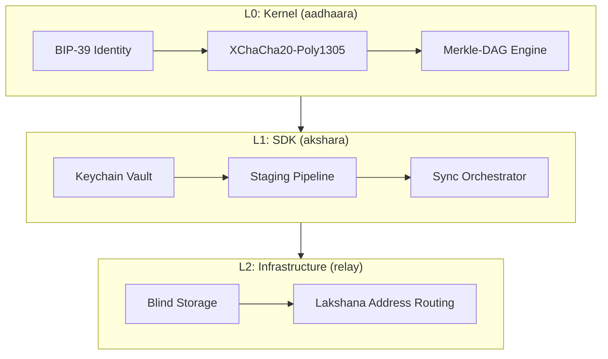

# ಅಕ್ಷರ (Akshara): The Imperishable Web

[](#license)
[](#development-status)
[](#project-directory--specs)

**Encrypted collaboration where the server can't read your data.**

> *If the math is healthy, the human is safe.*

---

## The Trust Crisis

**The modern web was built on trust. That is a structural vulnerability.**

Whether it is a cloud giant, a SaaS startup, or a self-hosted server—whoever hosts your data has ultimate access to read, analyze, or leak it. For public social networks, this might be acceptable. But for **healthcare**, **legal council**, and **corporate governance**, "trusting the landlord" is a fundamental design failure.

**Akshara sidesteps the landlord entirely.** 

We decompose your documents into cryptographically secure blocks, encrypt them with keys kept on your device, and sign every modification. When data leaves your device, it is already ciphertext. The hosting provider (Relay) is blind—it cannot read your contents, trace your identity, or leak information it never possessed.

---

## Architectural Superpowers

Akshara is engineered around six key design decisions that set it apart from standard databases, encryption tools, and local-first frameworks:

### 🛡️ 1. The Blind Relay & Metadata Shield
* **The Concept:** The Relay hosts blocks indexed only by anonymous, one-way derived **Lakshanas**. 
* **Why it matters:** The server does not just protect your content; it cannot link who you collaborate with, when you edit, or map which documents belong to the same project. Your social and project graph is completely invisible to the host.

### 🔑 2. Shadow Identities (Unlinkable Signatures)
* **The Concept:** Akshara derives graph-isolated signing keys from your master seed for every separate workspace.
* **Why it matters:** In traditional systems, signing multiple files with a single master key allows observers to link your identity across different projects. With Shadow Identities, your signatures on Project A cannot be cryptographically correlated with your signatures on Project B.

### ⚡ 3. Lazy Syncing & Deferred Decryption
* **The Concept:** Sync engines exchange only lightweight Merkle indexes and manifest timelines.
* **Why it matters:** You can sync a 100GB corporate workspace on a mobile phone in seconds. The sync layer does not download heavy payloads (like PDFs, images, or files) until they are explicitly resolved and read by the application.

### 📬 4. On-the-Fly Pre-Key Derivation
* **The Concept:** One-time-use handshake keys for offline collaboration are derived deterministically from your seed when a message arrives.
* **Why it matters:** Traditional E2EE apps require the device to store a database of active handshake private keys on disk, which are vulnerable to device theft. Akshara stores exactly zero pre-key private keys on disk.

### 🧬 5. Self-Sovereign Identity-as-a-Graph
* **The Concept:** A user's identity is not a static public key—it is a private, secure Merkle-DAG Graph.
* **Why it matters:** Adding a new laptop, updating user profile metadata, or instantly revoking a lost device's keys are simply signed commits to your Identity Graph, audited and reconciled across your devices mathematically.

### 🦀 6. Declarative Block Decomposition
* **The Concept:** Define complex data models directly in standard Rust structures annotated with `#[derive(AksharaDocument)]`.
* **Why it matters:** Attributes like `#[collaborative_text]` (sentence-level splitting for concurrent edits) or `#[chunked]` (automatic Merkle-linked file slicing) are resolved automatically by compile-time macros, eliminating thousands of lines of cryptographic boilerplate.

### 📜 7. Cryptographic Lineage & History Auditing
* **The Concept:** Document edits are tracked as Merkle-DAG revisions, retaining block-level signatures, author public keys, and timestamps.
* **Why it matters:** Standard database history systems can be tampered with or overwritten by database admins. Akshara makes history cryptographically non-refutable. You can query the typed or raw history of any document or field directly (`Graph::history::<T>` and `Graph::get_history`), attributing every single change to its specific author and signature.

---

## Akshara in 60 Seconds

### 1. Schema-Driven Documents (High-Level API)

Define your collaborative data models and interact with them using standard Rust structs. The SDK handles content-addressing, chunking, and encryption under the hood:

```rust
use akshara::{Client, ClientConfig};
use akshara_schema::{AksharaDocument, LazyField};
use serde::{Serialize, Deserialize};

// 1. Define your secure data model
#[derive(AksharaDocument, Serialize, Deserialize, Clone, Debug)]
struct CaseFolder {
    pub client_name: String,
    
    // Sentence-level splitting for concurrent real-time collaboration
    #[collaborative_text]
    pub summary: String,
    
    // Sliced automatically into cryptographically linked 1MB blocks
    #[chunked]
    pub video_evidence: Vec<u8>,
    
    // Address pointer resolved during sync, but payload download is deferred
    #[lazy]
    pub transcripts: LazyField<String>,
}

#[tokio::main]
async fn main() -> Result<(), Box<dyn std::error::Error>> {
    // 2. Initialize the client using the OS secure keychain vault
    let config = ClientConfig::new()
        .with_platform_vault() // OS Keychain integration (macOS/iOS Keychain Services)
        .with_in_memory_storage();
    let client = Client::init(config).await?;

    // 3. Create a new cryptographically isolated graph
    let graph = client.create_graph().await?;
    let doc_path = "/cases/alpha";

    // 4. Populate and stage the document
    let record = CaseFolder {
        client_name: "John Doe".to_string(),
        summary: "Defendant claims innocence. Evidence was collected at the scene.".to_string(),
        video_evidence: vec![0u8; 5 * 1024 * 1024], // 5 MB video payload
        transcripts: LazyField::new("transcripts".to_string()),
    };

    // Inserts metadata and stages blocks locally in the staging layer
    graph.insert_document(doc_path, &record).await?;

    // 5. Commit & seal to the Merkle-DAG (encrypts, signs, and generates block structures)
    let report = graph.flush().await?;
    println!("Flushed {} blocks to storage!", report.blocks_created);

    // 6. Retrieve and automatically reassemble the document
    // (This decrypts the main structure and metadata, but defers lazy fields)
    let recovered: CaseFolder = graph.get_document(doc_path).await?;
    println!("Loaded document for: {}", recovered.client_name);

    Ok(())
}
```

### 2. Direct Graph Handling (Granular API)

For raw byte manipulation, file attachments, and structural index inspections, bypass the schema layer to query paths directly:

```rust
// 1. Fetch raw binary attachments or specific sub-paths directly
// (For #[chunked] fields, the SDK reassembles the block slices transparently)
let video_bytes: Vec<u8> = graph.fetch_blob("/cases/alpha/video_evidence").await?;

// 2. Check path existence in the encrypted index
if graph.exists("/cases/alpha").await? {
    // 3. List active sub-paths under a prefix anonymously
    let paths = graph.list("/cases").await?;
    println!("Active cases: {:?}", paths); // Output: ["/cases/alpha"]
}

// 4. Query full cryptographic edit history of a document
let typed_history = graph.history::<CaseFolder>("/cases/alpha").await?;
for version in typed_history {
    println!(
        "Version committed by {} at {}: {}",
        version.author_fingerprint,
        version.authored_at,
        version.value.client_name
    );
}

// 5. Query raw byte lineage revision trail for audit
let raw_history = graph.get_history("/cases/alpha/.akshara.document").await?;
println!("Total raw edits: {}", raw_history.len());
```

---

## Architectural Topology

Akshara enforces a strict three-layer architecture to guarantee the "Blind Foundation" mandate:



| Crate | Layer | Responsibility | Knowledge |
| :--- | :--- | :--- | :--- |
| **`aadhaara`** | [L0 Kernel](./aadhaara/README.md) | Pure cryptography, Merkle-DAGs, Identity derivation, and sync logic. | Plaintext, Hashes |
| **`akshara`** | [L1 SDK](./akshara/README.md) | Staging pipeline, OS secure vault orchestration, and client API. | Plaintext, Secret Keys |
| **`relay`** | L2 Infrastructure | High-performance storage and anonymous routing. | **Blind:** Ciphertext Only |

---

## Files vs. Graphs

Traditional local-first systems sync entire files. Akshara syncs **Graphs**.

A Graph is a set of encrypted blocks sharing a cryptographic permission boundary (e.g., one medical case, one legal contract, one joint project).

* **Deterministic Edits:** Every update represents a state change in a cryptographically signed Merkle-DAG.
* **Semantic Merges:** Conflicts appear as explicit branches. Merges are negotiated on your local device—not by a server.
* **Permanent Provenance:** History is immutable and fully auditable from the genesis block onwards.

---

## Core Pillars

### 1. Satyate (ಸತ್ಯತೆ — Integrity)
Every block is content-addressed (CIDv1). Your device verifies the cryptographic proof of every incoming byte. You never have to "trust" that a peer or a host delivered the correct history.

### 2. Aadhaara (ಆಧಾರ — Foundation)
The Relay is entirely blind. It stores encrypted blocks indexed by anonymous, deterministic **Lakshanas**. It remains oblivious to the contents of the blocks, the authorship, and the permission rings.

### 3. Akshara (ಅಕ್ಷರ — Imperishable)
Because blocks are identified by *what they are* (content-addressed) rather than *where they live* (location-addressed), your data is location-independent. It survives server crashes, hosting bankruptcies, and infrastructure changes.

---

## Project Directory & Specs

### I'm New to Akshara
* **[Docs Overview](./docs/README.md)** — Architectural layout, specifications, and quick start guides.
* **[Vision & Philosophy](./docs/VISION.md)** — Why we build digital sanctuaries.

### Specifications
* **[Identity System](./docs/specs/identity/)** — SLIP-0010 derivation paths, keys, and revocation.
* **[Graph Model](./docs/specs/graph-model/)** — Core block formats, CIDs, manifests, and index trees.
* **[Sync Protocols](./docs/specs/synchronization/)** — Blind sync reconciliation engine.
* **[Sharing & Key Exchange](./docs/specs/sharing/)** — Async prekey handshakes and Lockbox envelopes.
* **[Storage Spec](./docs/specs/storage/)** — Core `GraphStore` traits and semantics.

---

## Development Status

Akshara is currently in **v0.1.0-alpha**. All core local cryptography, staging, vault adapters, and index pipelines are implemented and passing tests.

> [!WARNING]
> This is highly experimental cryptographic software. It has not been formally audited. Do not use in production or for securing sensitive real-world data.

### Currently Implemented
* **Identity Management:** BIP-39 + SLIP-0010 24-word recovery seed, signing keys, and derivation.
* **Cryptography:** XChaCha20-Poly1305 authenticated symmetric encryption, Ed25519 signatures, X25519 key exchange.
* **Document Engine:** Custom `AksharaDocument` derive macro with `#[collection]`, `#[chunked]`, `#[collaborative_text]` modifiers.
* **Security Guardrails:** Shadow identities for graph isolation, OS Keychain integration for branch secrets, and re-verification of incoming CIDs.
* **Storage Engine:** We updated `GraphStore` to be a pure byte-oriented trait (no cryptographic type leakage to DB drivers!). Plus, we wrote a fast persistent SQLite adapter with prepared query caching and a simple read connection pool to get parallel readers under WAL mode.
* **Sync Core:** Reconciler for local/remote head convergence, Auditor for chain-of-title checks, and mock transport layers.

### Next Milestones (v0.2)
* [ ] Production gRPC Relay client
* [ ] Lockbox-based async sharing flows
* [ ] WASM targets for web and mobile integration

---

## License

Akshara is licensed under the MIT License.

---

*ಅಕ್ಷರ (Akshara)* translates to **"The Imperishable"** or **"The Undying"** in Kannada (ಆಧಾರ represents the foundational support). It is software engineered to place math in service of human freedom.
